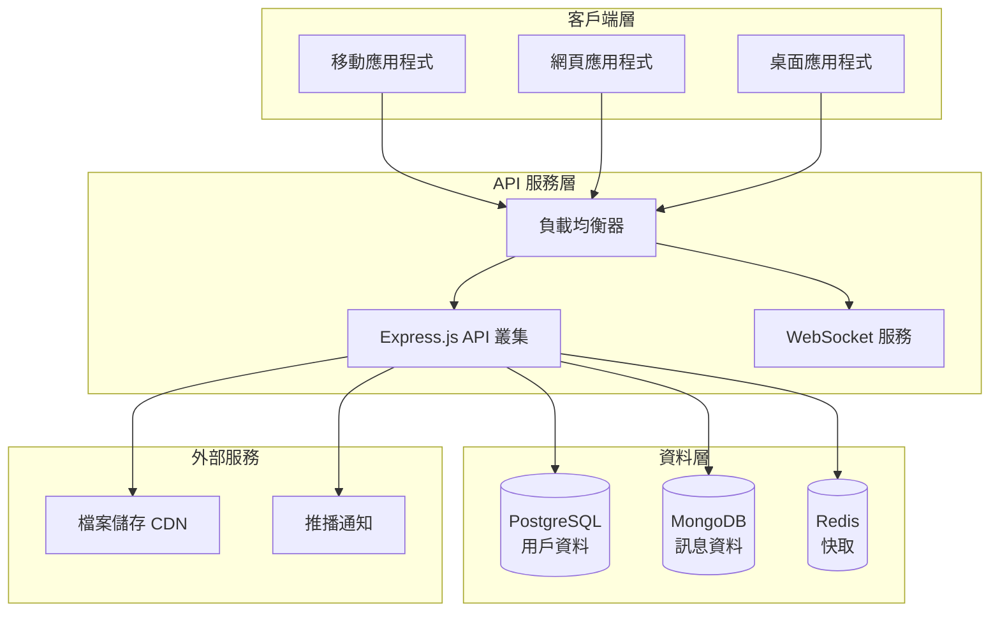

# 🚀 Messenger Lite Clone

[](https://www.typescriptlang.org/)
[](https://expressjs.com/)
[](https://cucumber.io/)
[](https://swagger.io/)
[](https://mermaid.js.org/)

基於 **行為驅動開發 (BDD)** 設計的輕量版即時通訊應用程式，採用 Express.js + TypeScript 技術棧，提供完整的系統架構設計與 API 規格文件。

## 🎯 專案特色

- **🏗️ 完整系統架構**: 使用 Mermaid 圖表展示微服務架構設計
- **📋 詳細 API 規格**: 48 個 API 端點，完整繁體中文 Swagger 文件
- **🧪 BDD 測試驅動**: 基於 Cucumber 的行為驅動開發流程
- **📊 資料庫設計**: PostgreSQL + MongoDB + Redis 多重儲存架構
- **🔒 安全第一**: JWT 認證、多層安全防護機制
- **🌐 完整文件系統**: 從架構到 API 的全方位文件支援

## 🚀 快速開始

### 📦 安裝依賴
```bash
npm install
```

### 🏃‍♂️ 啟動服務

#### 開發伺服器
```bash
npm run dev
# 🌐 API Server: http://localhost:3000
```

#### 文件伺服器
```bash
npm run docs
# 📚 文件中心: http://localhost:3001
```

### 🧪 執行測試
```bash
# 單元測試
npm run test

# BDD 測試 (需要 Node.js 20+)
npm run test:bdd

# 型別檢查
npm run typecheck

# 建構專案
npm run build
```

## 📚 文件導覽

### 🏠 文件中心
訪問 [http://localhost:3001](http://localhost:3001) 查看完整文件

| 文件類型 | 訪問路徑 | 說明 |
|---------|----------|------|
| **🏠 文件首頁** | `/` | 導覽頁面與功能概覽 |
| **📋 API 規格** | `/api-docs` | Swagger UI API 文件 |
| **🏗️ 系統架構** | `/architecture` | Mermaid 架構圖表 |
| **❤️ 健康檢查** | `/health` | 系統狀態監控 |

### 📖 主要文件
- [`swagger.yaml`](./swagger.yaml) - 完整 API 規格 (OpenAPI 3.0.3)
- [`docs/architecture.md`](./docs/architecture.md) - 系統架構設計
- [`API_DESIGN.md`](./API_DESIGN.md) - API 設計說明
- [`ARCHITECTURE_SUMMARY.md`](./ARCHITECTURE_SUMMARY.md) - 架構設計總結

## 🏗️ 系統架構概覽



## 📋 功能模組

### 🔐 使用者管理
- ✅ 註冊、登入、登出
- ✅ 電子郵件/手機驗證
- ✅ 個人資料管理
- ✅ 大頭照上傳

### 👥 好友管理  
- ✅ 多方式搜尋 (電子郵件、手機、用戶名)
- ✅ 好友邀請系統
- ✅ 好友分組管理
- ✅ QR Code 快速加友

### 💬 即時訊息
- ✅ 多媒體訊息 (文字、圖片、檔案、語音)
- ✅ 訊息狀態追蹤 (傳送中→已送達→已讀)
- ✅ 訊息編輯/刪除 (5分鐘內)
- ✅ 對話歷史搜尋

### 👨‍👩‍👧‍👦 群組聊天
- ✅ 群組建立與管理 (最多50人)
- ✅ 管理員權限控制
- ✅ @提及與回覆功能
- ✅ 群組通知設定

### 🔔 通知系統
- ✅ 推播通知管理
- ✅ 勿打擾模式與排程
- ✅ 重要聯絡人設定
- ✅ 通知歷史記錄

### 🔒 線上狀態與隱私
- ✅ 多種線上狀態 (線上/忙碌/離開/隱形/離線)
- ✅ 隱私設定控制
- ✅ 讀取回條管理
- ✅ 最後上線時間控制

## 🛠 技術棧

### 後端技術
- **Runtime**: Node.js 18+
- **Framework**: Express.js 5.x
- **Language**: TypeScript 5.x
- **Database**: PostgreSQL + MongoDB + Redis
- **Authentication**: JWT + bcrypt
- **Testing**: Jest + Cucumber
- **Documentation**: Swagger/OpenAPI 3.0.3

### 開發工具
- **Package Manager**: npm
- **Process Manager**: nodemon
- **Code Quality**: ESLint + Prettier
- **Testing Framework**: Jest + Supertest
- **BDD Framework**: Cucumber.js
- **Documentation**: Swagger UI + Mermaid

### 基礎設施 (規劃)
- **Containerization**: Docker + Kubernetes
- **Cloud Platform**: AWS/GCP/Azure
- **Monitoring**: Prometheus + Grafana
- **Logging**: ELK Stack
- **CI/CD**: GitHub Actions

## 📊 專案統計

| 項目 | 數量 | 說明 |
|------|------|------|
| **API 端點** | 48 個 | 涵蓋 7 大功能模組 |
| **BDD 場景** | 80+ 個 | 完整的功能測試覆蓋 |
| **資料表** | 16 個 | 完整的資料模型設計 |
| **架構圖表** | 4 類 | 系統、資料庫、流程、部署架構 |
| **文件頁面** | 4 個 | 多層次文件導覽系統 |

## 🎯 開發里程碑

### ✅ Phase 1: 設計與規劃 (已完成)
- [x] BDD 功能規格設計
- [x] API 端點設計 
- [x] 系統架構設計
- [x] 資料庫架構設計
- [x] 文件系統建置

### 🔄 Phase 2: 核心功能開發
- [ ] 用戶管理模組實作
- [ ] 好友系統實作
- [ ] 基礎訊息功能
- [ ] 資料庫集成

### 📋 Phase 3: 進階功能
- [ ] 群組聊天實作
- [ ] 多媒體訊息處理
- [ ] 即時通訊 (WebSocket)
- [ ] 推播通知整合

### 🚀 Phase 4: 部署與維運
- [ ] 容器化部署
- [ ] 監控系統整合
- [ ] 效能優化
- [ ] 安全加固

## 🤝 貢獻指南

### 開發流程
1. Fork 專案
2. 創建功能分支 (`git checkout -b feature/amazing-feature`)
3. 遵循 BDD 流程編寫功能
4. 確保測試通過 (`npm test`)
5. 提交變更 (`git commit -m 'Add amazing feature'`)
6. 推送分支 (`git push origin feature/amazing-feature`)
7. 開啟 Pull Request

### 程式碼規範
- 使用 TypeScript 嚴格模式
- 遵循 ESLint 配置
- 編寫 BDD 測試場景
- 更新 API 文件
- 添加適當的型別定義

## 📄 授權條款

本專案採用 MIT 授權條款。詳細內容請參閱 [LICENSE](./LICENSE) 檔案。

---

<div align="center">

**🚀 Ready to build the future of messaging!**

[📋 查看 API 文件](http://localhost:3001/api-docs) • [🏗️ 系統架構](http://localhost:3001/architecture) • [❤️ 系統狀態](http://localhost:3001/health)

Made with ❤️ using **BDD** + **TypeScript** + **Express.js**

</div>