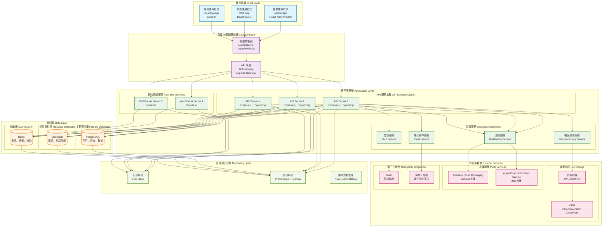
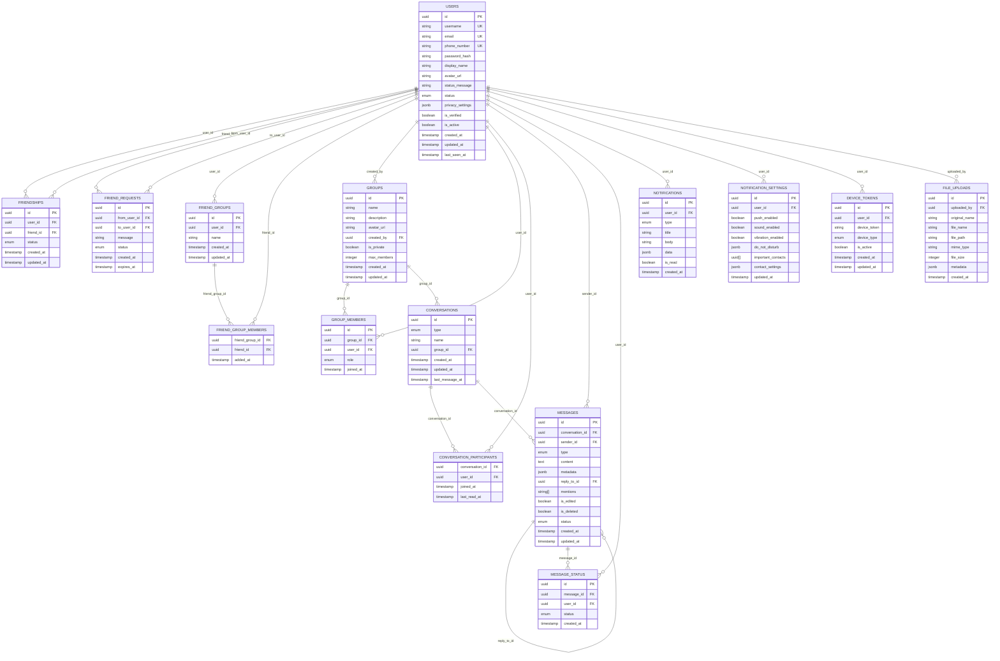
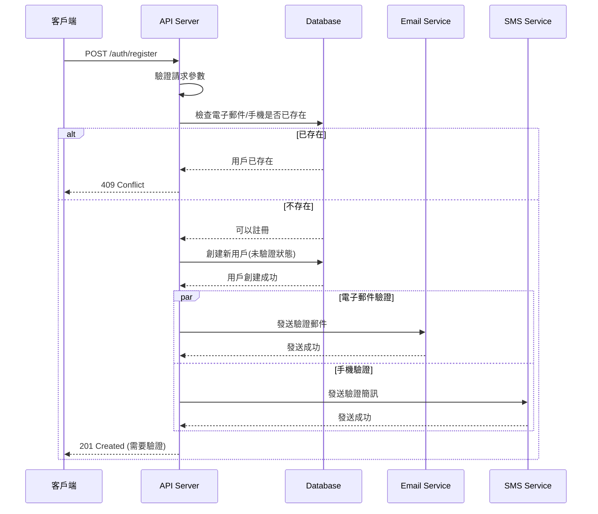
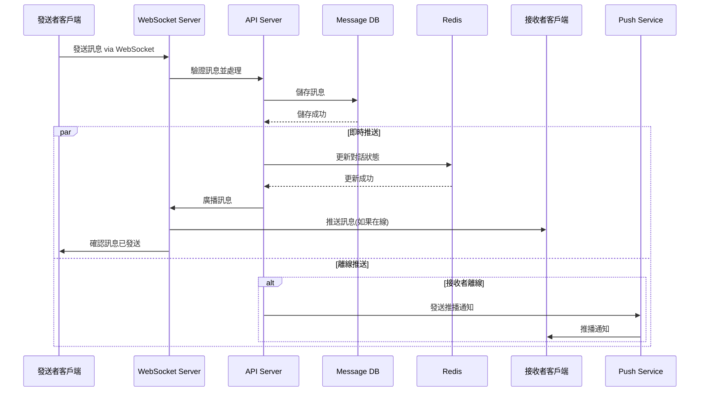
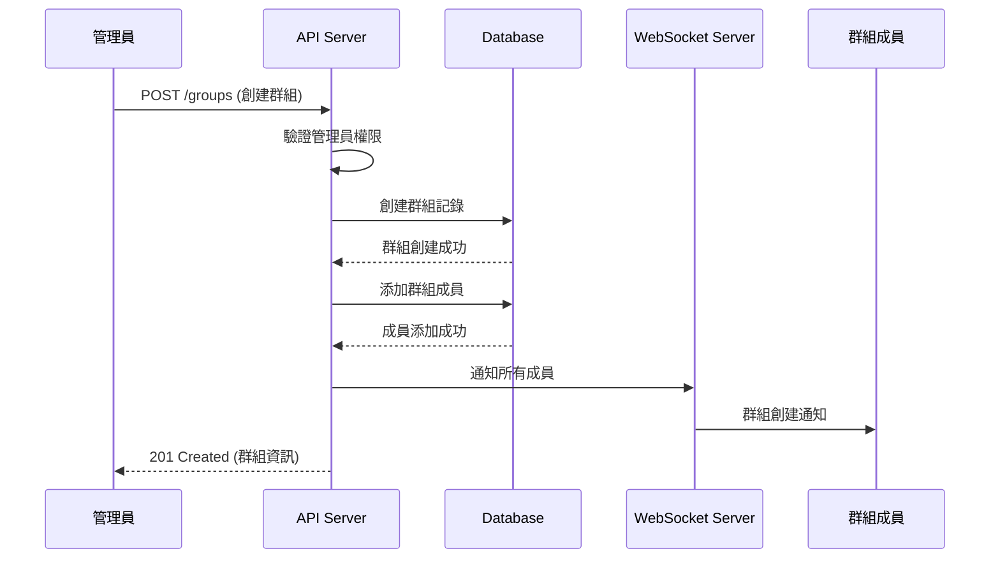

# Messenger Lite Clone 系統架構設計

## 🏗️ 系統整體架構

## 🗃️ 資料庫架構設計

## 🔄 API 流程圖

### 使用者註冊流程

### 即時訊息傳送流程

### 群組管理流程

## 🚀 部署架構

```mermaid
graph TB
    subgraph "生產環境 Production Environment"
        subgraph "DMZ 區域"
            ELB[Elastic Load Balancer<br/>負載均衡器]
            WAF[Web Application Firewall<br/>網路應用程式防火牆]
        end
        
        subgraph "應用層 Application Tier"
            subgraph "可用區域 A"
                API1[API Server Pod 1]
                WS1[WebSocket Pod 1]
            end
            
            subgraph "可用區域 B"  
                API2[API Server Pod 2]
                WS2[WebSocket Pod 2]
            end
            
            subgraph "可用區域 C"
                API3[API Server Pod 3]
                WS3[WebSocket Pod 3]
            end
        end
        
        subgraph "資料層 Data Tier"
            subgraph "主資料庫叢集"
                PG_PRIMARY[(PostgreSQL Primary)]
                PG_REPLICA1[(PostgreSQL Replica 1)]
                PG_REPLICA2[(PostgreSQL Replica 2)]
            end
            
            subgraph "訊息資料庫叢集"
                MONGO_PRIMARY[(MongoDB Primary)]
                MONGO_SECONDARY1[(MongoDB Secondary 1)]
                MONGO_SECONDARY2[(MongoDB Secondary 2)]
            end
            
            subgraph "快取叢集"
                REDIS_MASTER[(Redis Master)]
                REDIS_SLAVE1[(Redis Slave 1)]
                REDIS_SLAVE2[(Redis Slave 2)]
            end
        end
    end
    
    subgraph "外部服務 External Services"
        S3_PROD[AWS S3 Production]
        CDN_PROD[CloudFront CDN]
        FCM_PROD[FCM Production]
        APNS_PROD[APNS Production]
    end
    
    subgraph "監控與日誌 Monitoring"
        PROMETHEUS[Prometheus 監控]
        GRAFANA[Grafana 儀表板]
        ELK[ELK 日誌系統]
    end

    %% 流量路由
    WAF --> ELB
    ELB --> API1
    ELB --> API2  
    ELB --> API3
    ELB --> WS1
    ELB --> WS2
    ELB --> WS3

    %% 資料庫連接
    API1 --> PG_PRIMARY
    API1 --> PG_REPLICA1
    API1 --> MONGO_PRIMARY
    API1 --> REDIS_MASTER
    
    API2 --> PG_PRIMARY
    API2 --> PG_REPLICA2
    API2 --> MONGO_PRIMARY
    API2 --> REDIS_MASTER
    
    API3 --> PG_PRIMARY
    API3 --> PG_REPLICA1
    API3 --> MONGO_PRIMARY
    API3 --> REDIS_MASTER

    %% 資料庫複製
    PG_PRIMARY --> PG_REPLICA1
    PG_PRIMARY --> PG_REPLICA2
    MONGO_PRIMARY --> MONGO_SECONDARY1
    MONGO_PRIMARY --> MONGO_SECONDARY2
    REDIS_MASTER --> REDIS_SLAVE1
    REDIS_MASTER --> REDIS_SLAVE2

    %% 外部服務連接
    API1 --> S3_PROD
    API2 --> S3_PROD
    API3 --> S3_PROD
    S3_PROD --> CDN_PROD
    
    API1 --> FCM_PROD
    API2 --> FCM_PROD
    API3 --> FCM_PROD
    
    API1 --> APNS_PROD
    API2 --> APNS_PROD
    API3 --> APNS_PROD

    %% 監控連接
    API1 --> PROMETHEUS
    API2 --> PROMETHEUS
    API3 --> PROMETHEUS
    WS1 --> PROMETHEUS
    WS2 --> PROMETHEUS
    WS3 --> PROMETHEUS
    
    PROMETHEUS --> GRAFANA
    
    API1 --> ELK
    API2 --> ELK
    API3 --> ELK

    %% 樣式
    classDef prodClass fill:#e8f5e8,stroke:#2e7d32,stroke-width:2px
    classDef dataClass fill:#fff3e0,stroke:#ef6c00,stroke-width:2px
    classDef externalClass fill:#fce4ec,stroke:#c2185b,stroke-width:2px
    classDef monitorClass fill:#f1f8e9,stroke:#558b2f,stroke-width:2px

    class API1,API2,API3,WS1,WS2,WS3,ELB,WAF prodClass
    class PG_PRIMARY,PG_REPLICA1,PG_REPLICA2,MONGO_PRIMARY,MONGO_SECONDARY1,MONGO_SECONDARY2,REDIS_MASTER,REDIS_SLAVE1,REDIS_SLAVE2 dataClass
    class S3_PROD,CDN_PROD,FCM_PROD,APNS_PROD externalClass
    class PROMETHEUS,GRAFANA,ELK monitorClass
```

## 📊 容量規劃

### 預估使用量
- **活躍用戶**: 100萬人
- **同時在線**: 100,000人
- **每日訊息**: 1000萬則
- **檔案上傳**: 每日 100GB
- **推播通知**: 每日 500萬則

### 資源配置建議
- **API Server**: 6-8 個實例 (每個 4 核 8GB)
- **WebSocket Server**: 4-6 個實例 (每個 2 核 4GB)
- **PostgreSQL**: 主從架構 (主庫 8 核 32GB，從庫 4 核 16GB)
- **MongoDB**: 副本集 (每個 8 核 32GB)
- **Redis**: 叢集模式 (每個 4 核 16GB)

## 🔒 安全考量

### 網路安全
- **WAF**: 阻擋惡意請求
- **DDoS 防護**: 流量清洗
- **SSL/TLS**: 端到端加密
- **VPC**: 私有網路隔離

### 應用安全
- **JWT Token**: 短期有效期
- **Rate Limiting**: API 請求限制
- **輸入驗證**: 防止注入攻擊
- **權限控制**: RBAC 角色權限

### 資料安全
- **資料庫加密**: 靜態加密
- **備份加密**: 自動化備份
- **敏感資料**: 雜湊處理
- **審計日誌**: 操作追蹤